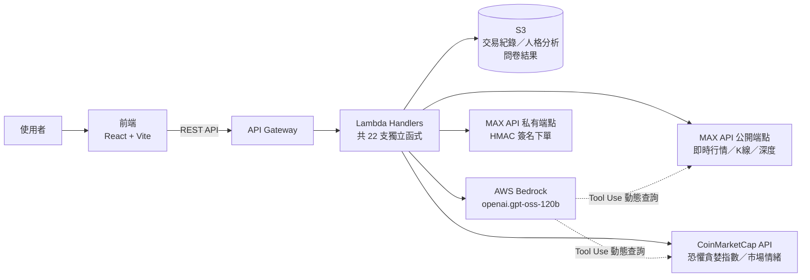

# 智慧投資 L.I.V.E.

> 第一個認識你、分析你、然後幫你下單的 AI 投資助理。

2026 雲湧智生：臺灣生成式 AI 應用黑客松競賽
命題單位：MaiCoin 現代財富科技股份有限公司　命題主題：智慧理財 — 打造現代 AI 投資工具

---

## 前言：這個專案在做什麼

**智慧投資 L.I.V.E.** 是一款以「直播頻道」為介面隱喻的 AI 加密貨幣投資助理。每個幣種對應一個直播頻道，K 線圖化為直播畫面，彈幕即時飄過呈現社群情緒，右側可切換 AI 私人諮詢與公開聊天室。

核心差異化在於**投資人格系統**：後端從使用者的交易紀錄計算風險（R）、情緒（E）、頻率（F）、策略（S）四軸指標，交由 AWS Bedrock 生成個人化描述，貫穿全站化為社群稱號——分析結果不是終點，而是使用者在整個互動介面裡的身分標籤。

AI 對話採用 **Bedrock Converse Tool Use**：模型自主判斷是否需要查詢即時幣價、恐懼貪婪指數、資金流向、技術指標，再決定是否提出結構化交易建議，並嚴格遵守「AI 只建議、人類決策」——所有建議需使用者按下確認鈕，才會透過 MAX Exchange 私有 API 送出真實下單。

本文件說明**程式怎麼運作**，方便評審快速理解架構與資料流；不含本機部署步驟（專案已部署於雲端，Demo 網址請見簡報）。

---

## 目錄

- [整體架構](#整體架構)
- [資料流：三個核心場景](#資料流三個核心場景)
- [前端結構](#前端結構)
- [後端結構](#後端結構)
- [外部服務串接](#外部服務串接)
- [資料儲存（S3）](#資料儲存s3)
- [已知限制與未來可改進之處](#已知限制與未來可改進之處)

---

## 整體架構



- **前端**：React + Vite，透過 `services/*Api.js` 統一以 `fetch` 呼叫後端，所有 API 呼叫走一層全域快取（30 秒 TTL）避免同一資料被重複請求
- **後端**：AWS SAM 管理的 Lambda + API Gateway，每個端點對應一支獨立 Lambda（見下方「後端結構」）
- **資料庫**：無傳統資料庫，全部用 S3 存 JSON/CSV（單人 MVP，無登入機制，靠固定 `user_id` 對應 `users/{userId}/...` 路徑）
- **AI**：AWS Bedrock（`openai.gpt-oss-120b-1:0`），透過 Converse API 的 Tool Use 機制自主查詢資料

---

## 資料流：三個核心場景

### 場景一：上傳 CSV → 產生投資人格

```
使用者上傳 CSV
  → POST /upload_csv（原始 CSV 存入 S3: users/{userId}/trades.csv）
  → 後端用 Python 計算 4 軸指標（風險/情緒/頻率/策略），FIFO 配對算已實現損益
  → 呼叫 Bedrock 生成人格描述文字
  → 結果存入 S3: users/{userId}/trade_metrics.json
  → 前端顯示人格徽章 + 資產總覽 + 交易歷史
```

之後每次進站，前端先呼叫 `GET /init` 確認 S3 是否已有 CSV，有的話直接讀取既有結果，**不會**要求重新上傳（`GET /personality`／`GET /portfolio`／`GET /trade_history` 都是純讀取，不重跑分析）。

### 場景二：AI 對話 → 動態查資料 → 提出交易建議

```
使用者輸入「我要賣出比特幣」
  → POST /ai_chat 帶入 currency=BTC
  → Bedrock 自主判斷需要哪些工具（0~4 個，依問題內容）：
      get_current_price（MAX）／get_fear_greed_index（CMC）／
      get_fund_flow_analysis（MAX 真實成交）／get_technical_indicators（MAX K線）
  → 工具結果餵回模型，最多循環 7 輪
  → 若判斷適合交易，呼叫 propose_trade 工具，直接輸出結構化 JSON
    （action / amount_twd / reason），而非文字關鍵字比對
  → 前端顯示建議卡片，使用者按「確認」才會呼叫 POST /allow_trade 送出真實下單
```

建議金額會參考使用者 CSV 算出的歷史平均單筆交易金額，沒有歷史紀錄的新用戶則採保守區間（NT$1,000～5,000）。

### 場景三：資金流向分析（直播頁「數據」分頁）

```
使用者切換時間週期（5分/1小時/4小時/1日）
  → GET /market/fund_flow
  → 後端呼叫 MAX 成交明細 API，依 timestamp 往回翻頁湊滿所選時間範圍
  → 依單筆成交金額（TWD）分類為特大單/大單/中單/小單，統計買賣方向
  → 另外用 K 線資料推算近 7 日淨流向（近似值，非逐筆彙總）
```

分類門檻（如「多少錢算大單」）沒有業界標準，是專案自訂並寫在 `backend/src/utils/constants.py` 中可調整的常數。

---

## 前端結構

```
frontend/src/
├── pages/                  # MainPage（幣種卡片）／CoinTrendPage（直播頁）／
│                           # CommunityPage／ProfilePage／QuestionnairePage
├── components/
│   ├── trend/              # K線圖、彈幕疊層、AI對話面板、資金流向圖、深度圖...
│   ├── community/          # 貼文卡片、留言、打賞、跟單按鈕
│   └── profile/            # 資產總覽
├── services/                # api.js（含全域快取）+ 各 xxxApi.js 對應 api.yaml 的 operationId
└── utils/                   # 純函式：技術指標計算、人格代碼推導、使用者身分常數
```

前端與後端的合約以 `backend/api.yaml`（OpenAPI 3.0.3）為單一事實來源。

## 後端結構

```
backend/src/
├── handlers/     # 22 支 Lambda handler，一個檔案對應一個 API 端點
├── services/     # 外部服務客戶端：max_api（公開）、max_trading（私有，HMAC簽名）、
│                 # coinmarketcap、bedrock（含 Tool Use 的 converse_raw）、ai_tools（工具定義）
└── utils/        # 純運算：metrics（CSV→人格分數/FIFO持倉）、fund_flow（資金流向分類）、
                  # indicators（技術指標）、constants（共用門檻/白名單）
```

主要端點對應：

| 端點 | 用途 |
|---|---|
| `GET /init`, `POST /upload_csv` | CSV 上傳與人格分析（首次觸發），之後可重跑分析不必重傳 |
| `GET /personality`, `GET /portfolio`, `GET /trade_history`, `GET /balance` | 讀取已計算好的人格分數、持倉、交易歷史、可用餘額 |
| `GET /coin/price`, `GET /candlestick_chart`, `GET /market/depth`, `GET /market/trades`, `GET /market/fund_flow` | 即時行情、K線、深度、成交明細、資金流向分析 |
| `GET /market/overview`, `GET /market/fear-greed`, `GET /notifications` | 行情看板、恐懼貪婪指數、動態通知 |
| `POST /ai_chat` | AI 對話（Tool Use 動態查詢 + 交易建議） |
| `POST /allow_trade` | 使用者確認後，透過 MAX 私有 API 執行真實下單 |
| `POST /ai_strategy` | 依策略類型（網格/定投/馬丁格爾等）由 AI 生成建議參數 |
| `GET/POST /questionnaire`, `GET/POST /quiz` | 投資人格問卷與補充測驗 |

完整規格與請求/回應範例請見 `backend/api.yaml`。

---

## 外部服務串接

| 服務 | 用途 | 驗證方式 |
|---|---|---|
| MAX Exchange API（公開端點） | 即時報價、K 線、深度、成交明細 | 無需驗證 |
| MAX Exchange API（私有端點） | 下單執行（`allow_trade.py`） | HMAC-SHA256 簽名（`MAX_API_KEY`/`MAX_API_SECRET`） |
| CoinMarketCap API | 恐懼貪婪指數、全球市值、漲跌幅排行 | 無需 API Key（keyless 模式） |
| AWS Bedrock | 人格描述生成、AI 對話與交易建議（Tool Use） | IAM Role（Lambda 執行角色） |

**只支援 6 種貨幣**：BTC / ETH / SOL / DOGE / USDT / USDC，所有排行榜與通知類功能都會過濾非此清單內的幣種，避免顯示使用者實際看不到、交易不到的幣。

---

## 資料儲存（S3）

無傳統資料庫，全部以 JSON/CSV 存放在單一 S3 Bucket：

| 資料 | S3 路徑 | 寫入時機 |
|---|---|---|
| 交易紀錄原始 CSV | `users/{userId}/trades.csv` | 使用者上傳時 |
| 人格分析結果（分數+AI描述） | `users/{userId}/trade_metrics.json` | 上傳 CSV 或提交問卷時 |
| 問卷/補充測驗結果 | `users/{userId}/questionnaire/...` | 提交問卷時 |

因為是單人 MVP（無登入機制），`user_id` 目前是前端固定帶入的常數，用於區分 S3 路徑。

---

## 已知限制與未來可改進之處

以下是目前有意識保留、尚未處理的缺口，誠實列出以避免誤導：

- **AI 執行下單後，交易紀錄尚未自動寫回 S3**：透過 `POST /allow_trade` 成功下單後，該筆交易不會自動更新 `trades.csv`，使用者需重新上傳最新 CSV 才能在資產總覽反映這筆交易。這是目前「對話 → 建議 → 確認 → 下單」閉環中還沒補上的一段。
- **正式環境的 MAX 私有 API 金鑰尚未設定**：`template.yaml` 中 `MAX_API_KEY`/`MAX_API_SECRET` 部署時預設為空字串，需另外以參數覆寫方式帶入才能實際下單。
- **社群貼文與彈幕訊息尚未接上 S3**：目前僅為前端展示用的模擬資料，尚未持久化儲存，規劃為後續擴充項目。
- **巨鯨警報為示範用資料**：因鏈上大額轉帳監控服務（如 Whale Alert）無免費方案，且多鏈位址標記資料庫超出本次時程，此功能以明確標註「（展示用）」的模擬資料呈現互動效果，並非真實鏈上監控。
- **資金流向分類門檻為自訂慣例，非業界標準**：目前尚無公定的「大單/小單」定義，本專案採用固定 TWD 金額門檻（詳見 `backend/src/utils/constants.py`），可依需求調整。

---

## 團隊

| 成員 | 負責 |
| --- | --- |
| 林睿瑜 | 隊長、前端、API 文件 |
| 林志恩 | 前端：直播頁面 |
| 郭凱明 | 前端：主頁面 |
| 趙文睿 | 後端 A：基礎建設 + API 串接 |
| 薛宇宏 | 後端 B：AI 核心 |
